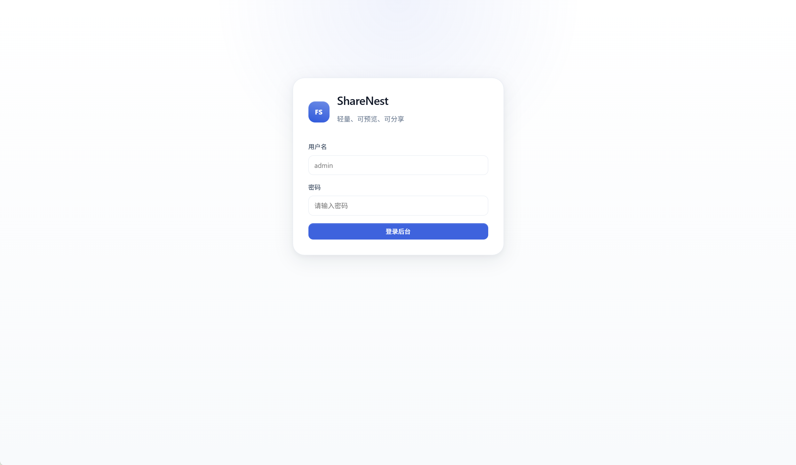
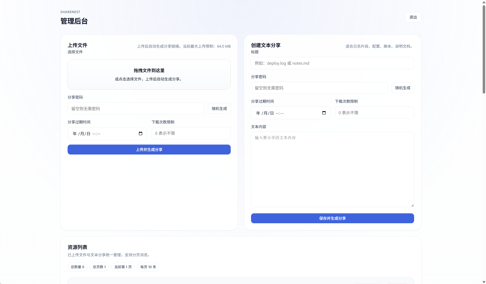
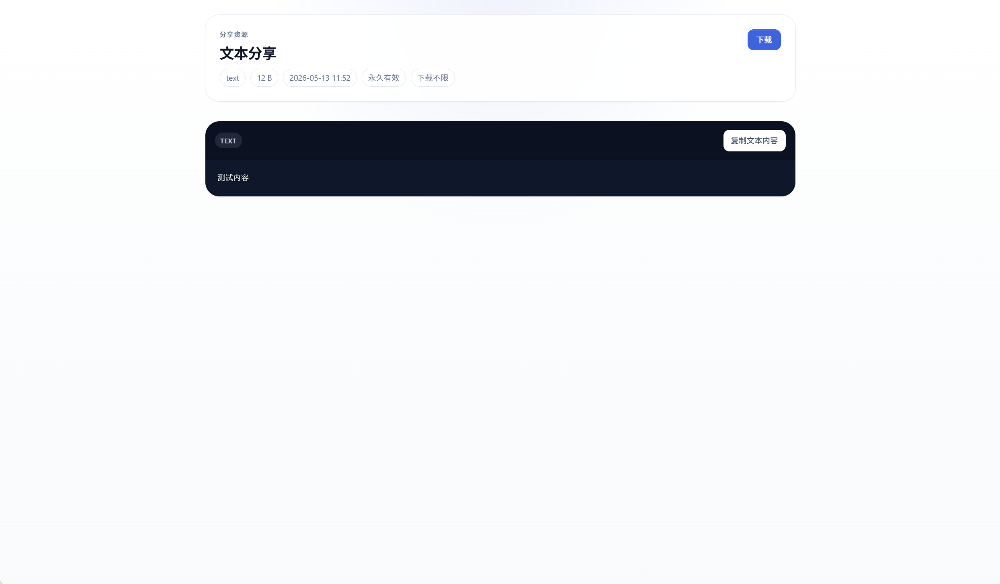
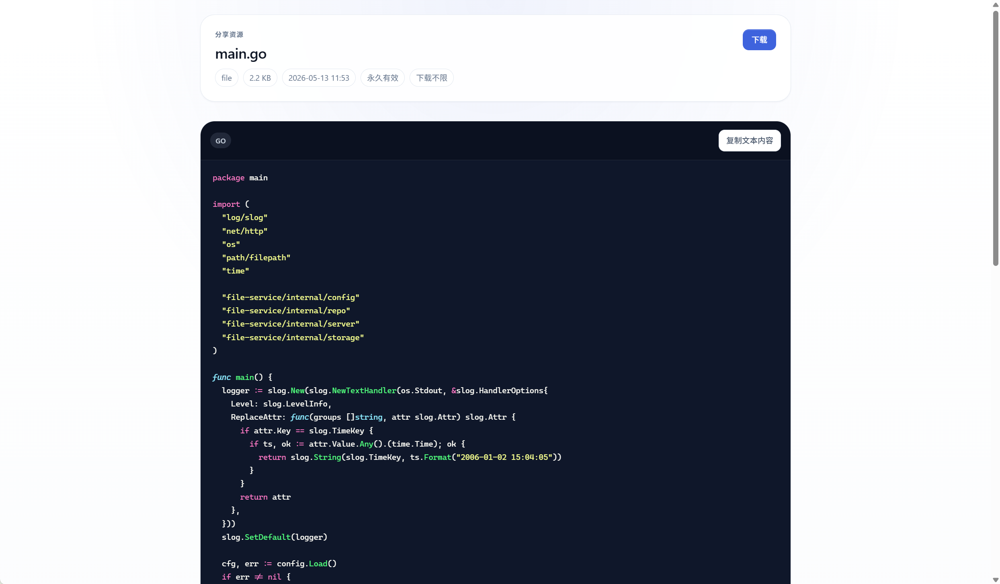

# ShareNest
<p align="center">
  
</p>

`ShareNest` 是一个轻量级的 Go 文件与文本分享服务，主打：

- 单二进制部署
- 文件与文本统一分享
- 带密码和免密码分享
- 常见格式在线预览
- 本地二维码分享
- 简约、实用、适配移动端的管理后台

## 功能概览

- 文件上传、文本创建、分享链接生成
- 分享密码、随机密码、带密码 URL 直达
- 分享页、后台资源列表、创建成功卡片统一支持二维码分享
- 分享过期时间、下载次数限制
- 仪表盘、文件、分享、配置分栏管理
- 资源搜索、下载记录、下载次数统计
- 固定过期选项与后台系统配置
- 访问日志
- 拖拽上传
- 上传进度提示
- 批量删除、批量复制分享链接
- 文本、代码、Markdown、图片、SVG、PDF 预览
- 音频、视频预览
- 压缩包元信息预览
- 二进制文件元信息预览
- 文本下载文件名支持中文
- SQLite 持久化
- 本地磁盘存储
- 二维码由服务端本地生成，不依赖第三方在线服务
- 自动读取项目根目录 `.env`
- 内置 favicon
- 后台资源列表分页

## 项目预览

示例预览区：






## 运行要求

- Go 1.25+
- SQLite 驱动：`modernc.org/sqlite`

本地启动：

```powershell
go mod tidy
go run ./cmd/server
```

## 环境变量

建议先复制配置模板：

```powershell
Copy-Item .env.example .env
```

常用配置如下：

```powershell
$env:FILESERVICE_SITE_NAME="ShareNest"
$env:FILESERVICE_ADDR=":8080"
$env:FILESERVICE_DATA_DIR="data"
$env:FILESERVICE_BASE_URL="http://127.0.0.1:8080"
$env:FILESERVICE_ADMIN_USER="admin"
$env:FILESERVICE_ADMIN_PASS="admin123"
$env:FILESERVICE_SESSION_SECRET="replace-with-random-secret"
```

说明：

- 上传大小、预览限制、分页大小、访问日志保留条数、默认过期选项等业务配置，首次启动后会写入 SQLite 默认值。
- 后续请在后台 `配置` 页面直接修改，不再依赖环境变量。
- 环境变量主要保留部署与安全相关配置，例如监听地址、数据目录、管理员账号、会话密钥等。

如果未显式配置 `FILESERVICE_SESSION_SECRET`，程序会在 `data/session_secret` 自动生成并持久化一个随机 secret。公网部署建议显式配置，避免迁移或多实例部署时会话不一致。

## 默认地址

- 登录页：`/login`
- 管理后台入口：`/admin`
- 仪表盘：`/admin/dashboard`
- 文件页：`/admin/files`
- 分享页：`/admin/shares`
- 配置页：`/admin/settings`

## 目录说明

- `cmd/server`：程序入口
- `internal/server`：HTTP 路由、页面渲染、业务流程
- `internal/storage`：本地文件存储
- `internal/repo`：SQLite 数据访问
- `internal/preview`：文本、代码、Markdown、压缩包等预览逻辑
- `internal/ui`：模板、静态资源、样式
- `docs/screenshots`：README 预览截图目录
